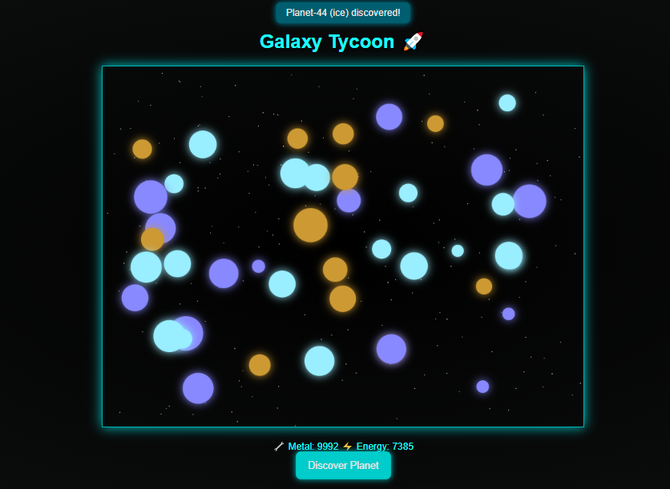

# 🌌 Galaxy Tycoon

**Galaxy Tycoon** is a canvas-powered space simulation game built with pure JavaScript, HTML, and SCSS — no external assets, no icons, just dynamic visuals and modular code. Discover planets, collect resources, and expand your empire across the stars.


---

## 🚀 Features

- 🎨 **Canvas-based visuals**: Planets, stars, and galactic effects rendered entirely in JS
- ⚙️ **Modular architecture**: Clean file structure with separate logic, UI, and rendering layers
- 🌌 **Planet discovery engine**: Procedural generation of gas, rocky, and ice worlds
- 📈 **Resource system**: Metal and energy tracking with dynamic UI updates
- 💡 **No images, no icons**: Everything is generated — lightweight and GitHub-friendly

---

## 🛠️ Setup

```bash
npm install
npm run scss
```
Then open index.html in your browser and start discovering planets!

📷 Preview


## 🌐 Live Demo

Experience Galaxy Tycoon in action:  
👉 [Launch Demo](galaxy-tycoon.vercel.app)

🧠 Lore Snippets
"In the year 3025, humanity expanded beyond the Milky Way." "Gas giants hold secrets of quantum energy." "Rocky worlds are rich in metal but hostile to life."

🧑‍🚀 Author
Murad – Visionary backend architect and full-stack developer.

📄 License
This project is licensed under the MIT License. See LICENSE for details.
